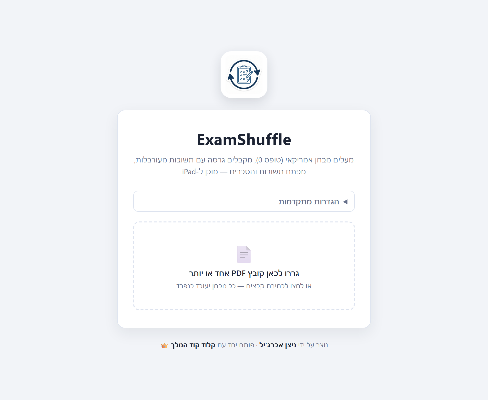

<div align="center">


# ExamShuffle

**Turn a “form 0” exam PDF (where option A is always correct) into a shuffled exam + full answer key — without ever re-typesetting a single question.**

[](https://www.typescriptlang.org/)
[](https://nodejs.org/)
[](https://react.dev/)
[](https://vitejs.dev/)
[](https://expressjs.com/)
[](https://pptr.dev/)
[](https://www.mongodb.com/)
[](https://www.docker.com/)
[](https://ai.google.dev/)



</div>

## Why

Practice exams often ship as a “form 0” where the first option is always the answer. Great
for an answer key, useless for actually studying. ExamShuffle shuffles the options and
hands you a truthful key — but the hard part is doing it **without mangling the exam**:
tables, math, subscripts, Hebrew RTL, and figures all have to survive untouched. It does
that by **copying the original pixels** instead of re-typing anything.

## Features

- 📄 **Pixel-perfect** — question stems and option rows are cropped from a high-res render of
  the source PDF, so fonts, tables, formulas and images are preserved exactly.
- 🔀 **Provably correct key** — options are shuffled locally with crypto Fisher-Yates; the AI
  never decides the answer, so the answer-key letter is always truthful.
- 🧠 **AI only where it’s safe** — Google Gemini writes the explanations/refutations and lists
  questions; it never touches question geometry or content.
- 🌐 **RTL-aware** — built for Hebrew exams (institution/course header, מועד subtitle, RTL
  layout), works for LTR too.
- 📚 **Open-question modes** — convert to multiple-choice, keep with a model answer, or remove.
- 📦 **Batch upload** — drop several PDFs; each gets its own progress bar and auto-downloads.
- 💾 **Durable jobs** — optional MongoDB store keeps jobs + output PDFs across restarts.

## How it works

1. **Analyze (AI)** — the PDF goes to Google Gemini once, with an enforced JSON schema. The
   model only lists questions (number + page) and writes explanations/refutations.
2. **Locate (deterministic)** — the pdf.js text layer gives exact glyph coordinates. Question
   numbers and option letters (`א.`/`ב.`/`A.`/`B.`) anchor each question; stem and option
   regions are computed geometrically. Cover/instruction/draft pages are skipped.
3. **Copy (pixels)** — each stem and option row is cropped from a 2.5× render of the original
   page. The printed option letter is erased by pixel scanning and replaced with the new
   shuffled letter. Nothing is re-typeset.
4. **Shuffle** — options are shuffled locally (crypto Fisher-Yates) so the key stays truthful.
5. **Render** — the shuffled exam is composed as RTL HTML and exported to PDF via headless
   Chromium: 2 questions/page, answer key on a fresh page with the correct letter, correct
   option image, explanation and refutations.

## Requirements

- Node.js 20+
- A Gemini API key in `.env` (see `.env.example`) — or enter it in the UI at runtime
- Input PDFs must contain selectable text (scanned image-only PDFs are not supported)

## Quick start

```bash
npm install
cp .env.example .env      # optional: add your Gemini API key/model
npm run build             # build the React app once
npm start                 # serves UI + API at http://localhost:3000
```

Drag one or more exam PDFs in — each file gets its own progress bar and downloads
automatically when ready. A job keeps running on the server even if you close or refresh the
tab; reopening the page restores in-progress jobs and their download links.

**Advanced settings** (collapsible panel):

- **Gemini model / API key** — override the server’s `.env` per run.
- **Reference material** — a public URL or an uploaded PDF/TXT/MD (e.g. a NotebookLM summary
  export) used to ground the explanations. NotebookLM links are login-walled and can’t be
  fetched server-side — export and upload the summary instead.
- **Open (non-multiple-choice) questions** — convert to MCQ, keep with a model answer, or
  remove.

### Development

```bash
npm run dev               # Vite hot reload on :5173, API on :3000
```

## CLI

```bash
npm run cli -- path/to/exam.pdf                       # -> output/exam.shuffled.pdf
npm run cli -- path/to/exam.pdf -o my-exam.pdf
npm run cli -- path/to/exam.pdf --open-mode convert   # convert | keep | remove

npm run sample                                        # writes samples/sample-exam.pdf
npm run cli -- samples/sample-exam.pdf                # try it end to end
```

## Deploy

The repo ships a `Dockerfile` that installs Chromium + Hebrew/Latin fonts, builds the web
bundle, and runs `npm start` (serving both API and UI on `$PORT`).

> **Memory:** headless Chromium + the 2.5× render need real RAM. **512 MB free tiers get
> OOM-killed** (exit code 137). Give the container **≥ 1–2 GB**.

### Railway

1. Create a Railway project from this repo (it auto-detects the Dockerfile).
2. Optionally set `GEMINI_API_KEY` / `GEMINI_MODEL` service variables.
3. Optionally set `MONGODB_URI` (+ `MONGODB_DB`) for durable jobs — see below.
4. Deploy. Raise the service memory if uploads fail mid-job.

### Hugging Face Spaces (free 16 GB RAM)

The free CPU Space tier gives **16 GB RAM** — plenty for Chromium. The YAML frontmatter at
the top of this README (`sdk: docker`, `app_port: 7860`) tells Spaces to build the Dockerfile.

1. Create a Space → <https://huggingface.co/new-space> → **SDK: Docker** → **Blank**.
2. Push this repo to the Space’s git remote (keep the frontmatter at the very top).
3. In **Settings → Variables and secrets**, add `MONGODB_URI` (secret) + `MONGODB_DB`
   (variable), and optionally `GEMINI_API_KEY` (secret) / `GEMINI_MODEL` (variable).
4. The Space builds the image and serves the app at its public URL.

Free Spaces sleep after ~48 h idle and cold-start on the next visit (~30–60 s); the durable
Mongo store means a sleep never loses jobs.

### Job persistence

Jobs run one at a time in memory. Without `MONGODB_URI`, records fall back to a local
`output/jobs.json` and PDFs live on the container’s disk — both are lost on restart/redeploy.
Set `MONGODB_URI` (any MongoDB — Atlas has a free tier) to store job records and output PDFs
(GridFS) durably: a restart then reports interrupted jobs as a clear error instead of a dead
poll, and finished downloads keep working. A missing/unreachable URI logs a warning and falls
back to the file store, so a bad value never blocks startup.

> Run a **single instance** — the in-memory queue is per-process (don’t scale to replicas).

## Project structure

```text
server/src/ai/analyze.ts      Gemini call: metadata, question list, explanations
server/src/pdf/pdf.ts         pdf.js wrapper: page rendering + text-layer lines
server/src/pdf/polyfill.ts    Node 20 shims for pdfjs-dist
server/src/pdf/render.ts      Puppeteer HTML -> PDF
server/src/exam/layout.ts     deterministic question/option region detection
server/src/exam/crop.ts       pixel cropping, label erase, whitespace trim
server/src/exam/shuffle.ts    crypto Fisher-Yates + option letters
server/src/exam/template.ts   RTL HTML composition (2 questions/page, answer key)
server/src/exam/pipeline.ts   orchestration with progress reporting
server/src/api/server.ts      Express API: batch upload, job queue, download
server/src/api/jobs.ts        job store (in-memory + durable backend)
server/src/api/jobStore.ts    file / MongoDB (GridFS) persistence backends
server/src/shared/            types + env loading
server/src/cli.ts             command-line entry
web/src/                      React UI: multi-upload, settings, per-file progress
```

---

<div align="center">

Built by **ניצן אברג'יל** · with **קלוד קוד המלך 👑**

</div>
